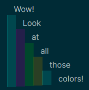
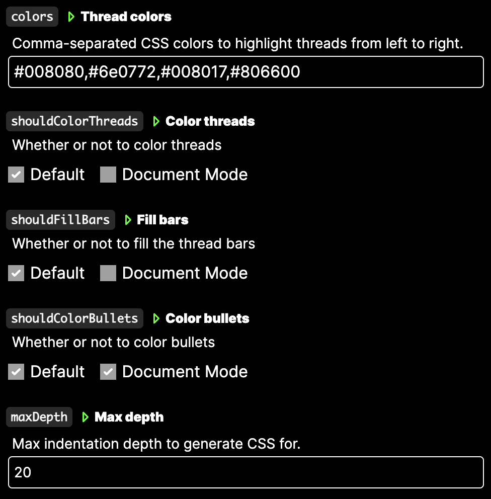

# Logseq Colored Threads

Add thread coloring to your blocks in Logseq!

> Color threads, highlight indentation, and color bullets to see hierarchies easier.

## Examples

### Default mode

### Document mode (optional)

## Settings

## Issues

Please report any issue to <https://github.com/patrickdevries/logseq-plugin-colored-threads>
